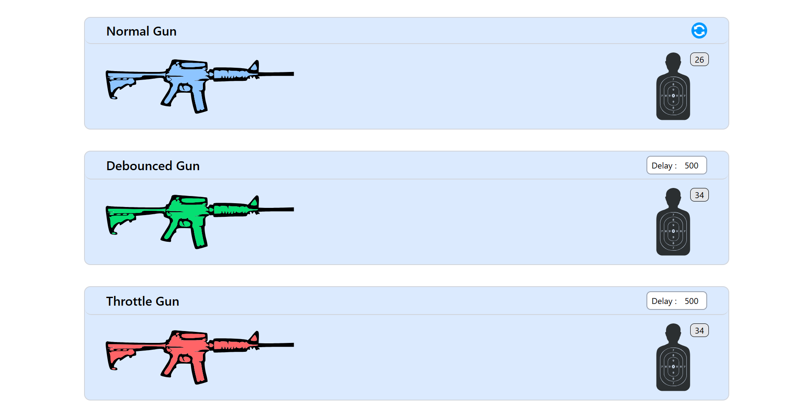
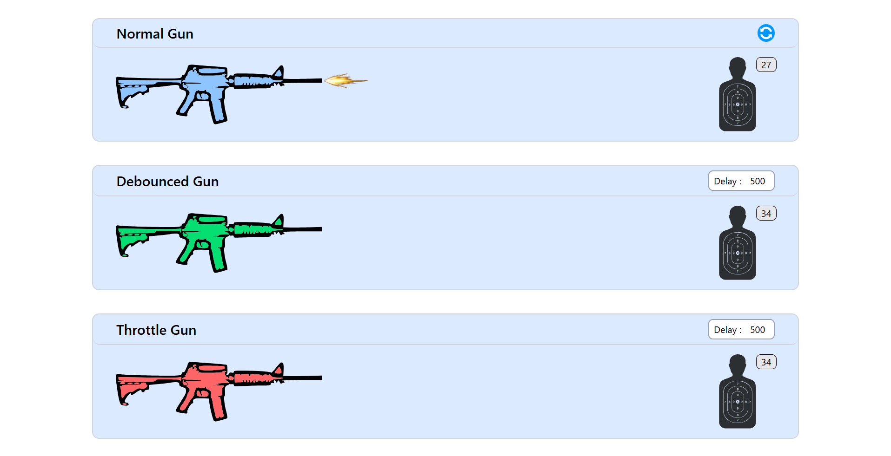

# 🎯 Debounce & Throttle Visualizer

An interactive React application that demonstrates the difference between **debouncing** and **throttling** techniques through a fun gun-shooting game interface.





## 🚀 Features

- **Visual Learning**: Interactive gun-shooting metaphor to understand debouncing and throttling
- **Real-time Comparison**: See the difference between normal, debounced, and throttled behavior
- **Customizable Delays**: Adjust debounce and throttle delays in real-time
- **Modern UI**: Clean, responsive design built with Tailwind CSS

## 🎮 How It Works

### Normal Gun 🔫

- Every click fires immediately
- Shows the baseline behavior without any optimization

### Debounced Gun ⏱️

- Delays execution until after a specified time has passed since the last trigger
- Perfect for search inputs, form validation, or API calls
- **Use Case**: "Wait until the user stops typing before searching"

### Throttled Gun 🚦

- Limits execution to once per specified time interval
- Ideal for scroll events, button clicks, or resize handlers
- **Use Case**: "Execute at most once every X milliseconds"

## 🛠️ Tech Stack

- **Frontend**: React 18, Redux Toolkit
- **Styling**: Tailwind CSS
- **Icons**: Custom SVG components
- **State Management**: Redux with custom hooks
- **Build Tool**: Vite

## 📦 Installation

1. **Clone the repository**

   ```bash
   git clone https://github.com/akshitjain3/debounce-throttle-visualizer.git
   cd debounce-throttle-visualizer
   ```

2. **Install dependencies**

   ```bash
   npm install
   # or
   yarn install
   ```

3. **Start the development server**

   ```bash
   npm run dev
   # or
   yarn dev
   ```

4. **Open your browser**
   ```
   http://localhost:5173
   ```

## 🎯 Usage

1. **Try the Normal Gun**: Click rapidly to see immediate responses
2. **Test Debouncing**:
   - Set a delay (e.g., 1000ms)
   - Click rapidly and notice how it waits for you to stop
3. **Test Throttling**:
   - Set a delay (e.g., 1000ms)
   - Click rapidly and see how it limits execution frequency
4. **Compare Results**: Notice the difference in hit counts between all three approaches

## 🏗️ Project Structure

```
src/
├── components/
│   ├── custom-hooks/
│   │   ├── useDebounce.js      # Custom debounce hook
│   │   └── useThrottle.js      # Custom throttle hook
│   ├── Arena.jsx               # Reusable arena component
│   ├── DebouncedGun.jsx        # Debounced gun implementation
│   ├── DebounceTarget.jsx      # Debounce target board component
│   ├── Gun.jsx                 # Gun SVG component
│   ├── NormalGun.jsx           # Normal gun implementation
│   ├── NormalTarget.jsx        # Normal target board component
│   ├── TargetBoard.jsx         # Target SVG component
│   ├── ThrottleGun.jsx         # Throttled gun implementation
│   └── ThrottleTarget.jsx      # Throttle target board component
│
├── store/
│   ├── slices/
│   │   └── gunSlice.js         # Redux state management
│   └── index.js                # Store configuration
├── App.jsx                     # Main application component
└── main.jsx                    # Application entry point
```

## 🔧 Custom Hooks

### useDebounce

```javascript
const debouncedCallback = useDebounce(callback, delay);
```

Delays function execution until after `delay` milliseconds have elapsed since the last time it was invoked.

### useThrottle

```javascript
const throttledCallback = useThrottle(callback, delay);
```

Limits function execution to at most once per `delay` milliseconds.

## 📊 Performance Benefits

| Technique    | Use Case                       | Benefit                                              |
| ------------ | ------------------------------ | ---------------------------------------------------- |
| **Debounce** | Search inputs, form validation | Reduces API calls by 70-90%                          |
| **Throttle** | Scroll events, resize handlers | Improves performance by limiting execution frequency |

## 🎨 Customization

### Changing Delays

- Adjust debounce/throttle delays using the input fields
- Range: 0-5000 milliseconds
- Changes apply in real-time

### Styling

The project uses Tailwind CSS. Key customization points:

- Colors: Modify the color scheme in `tailwind.config.js`
- Layout: Adjust spacing and sizing in component files

## 🐛 Common Issues

### Issue: Delays not applying

**Solution**: Ensure input values are valid numbers between 0-5000

### Issue: Clicks not registering

**Solution**: Check browser console for JavaScript errors

### Issue: Performance problems

**Solution**: Avoid setting extremely low delay values (< 50ms)

## 🚀 Deployment

### Build for production

```bash
npm run build
```

### Deploy to Netlify/Vercel

1. Connect your GitHub repository
2. Set build command: `npm run build`
3. Set publish directory: `dist`

## 🤝 Contributing

1. Fork the repository
2. Create a feature branch (`git checkout -b feature/amazing-feature`)
3. Commit your changes (`git commit -m 'Add some amazing feature'`)
4. Push to the branch (`git push origin feature/amazing-feature`)
5. Open a Pull Request

## 🙏 Acknowledgments

- Inspired by the need to visualize abstract programming concepts
- Built with modern React patterns and best practices
- SVG icons created with care for the shooting theme

## 📞 Contact

Akshit Jain

**LinkedIn** - [@akshitjain3](https://www.linkedin.com/in/akshit-jain-499ba78b/)<br>
**Email** - akshitjain3@gmail.com<br>
**Project Link** - [https://github.com/akshitjain3/debounce-throttle-visualizer](https://github.com/akshitjain3/debounce-throttle-visualizer)

---

⭐ **Star this repo if it helped you understand debouncing and throttling!** ⭐
